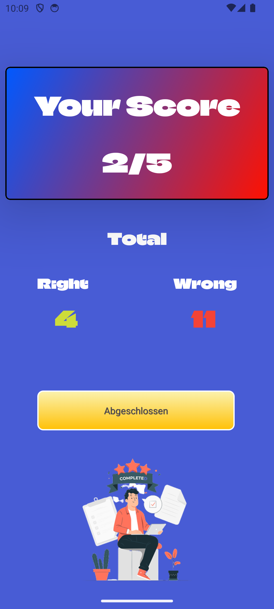

<!---->

<h1>Quizzy</h1>

<h3>Bereit für die nächste Frage? Quizzy ist es!.</h3>

Was ist Quizzy?

Quizzy ist eine interaktive Quiz-App, die entwickelt wurde, um dein Wissen auf spielerische und spannende Weise herauszufordern und zu erweitern. Egal, ob du ein Quiz-Enthusiast bist, der sein Fachwissen testen möchte, oder jemand, der einfach nur neugierig ist und täglich etwas Neues lernen möchte – Quizzy ist die perfekte Begleitung für dich.

 

Wofür ist Quizzy?

Mit Quizzy kannst du:

- <b>Dein Wissen testen:</b> Stelle dich einer Vielzahl von Fragen aus verschiedenen Kategorien und finde heraus, wie gut du wirklich bist.

- <b>Neues lernen:</b> Jede Frage ist eine Gelegenheit, dein Wissen zu erweitern und interessante Fakten zu entdecken.

- <b>Dich selbst herausfordern:</b> Verfolge deine Fortschritte, verbessere deine Highscores und werde zum ultimativen Quiz-Meister.

- <b>Spaß haben:</b> Die intuitive Benutzeroberfläche und das fesselnde Gameplay sorgen dafür, dass das Lernen nie langweilig wird.

Quizzy ist mehr als nur eine App – es ist dein täglicher Wissens-Boost, der dich unterhält und gleichzeitig schlauer macht. Bereit für die nächste Frage? Quizzy ist es!
 
 

   

Features:
- [X] Vielfältige Kategorien: Eine breite Auswahl an Themengebieten (z.B. Geschichte, Wissenschaft, Geografie, Popkultur, Sport), damit für jeden etwas dabei ist.
- [X] Benutzerfreundliche Oberfläche: Eine intuitive und ansprechende Gestaltung, die das Navigieren und Spielen einfach macht.
- [X] Highscore-System: Verfolge die besten Ergebnisse der Spieler und motiviere sie, sich selbst zu übertreffen.
- [X] Feedback zu Antworten: Gibt sofortiges Feedback, ob eine Antwort richtig oder falsch war.
- [X] Fortschritt speichern: Stellt sicher, dass der Spielstand und die Erfolge des Benutzers gespeichert werden.
- [ ] Detaillierte Statistiken: Zeige Spielern ihre Fortschritte, Stärken und Schwächen in verschiedenen Kategorien an.
- [ ] Offline-Modus: Ermögliche das Spielen auch ohne Internetverbindung.
- [ ] ...

Architektur(MVVM):

- MainViewModel()

Model:
- Categorie
- Quiz
- Result
- TriviaCategory
- User

Datenspeicherung:
- Room-Database 2.7.2

API Calls:
- Open Trivia DB Api

Dependencies/Repositories:
- Retrofit 3.0.0 - Für Netzwerkoperationen
- Coil 2.7.0 - Für das laden von lokalen und asynchronen Bildern
- Logging Interceptor 4.12.0 - Für den Ablauf von Anwendungen zu protokollieren
- navArgs 2.9.1 - Für das sichere navigieren zwischen Fragmenten und weiterreichen der Argumente

